Part A

In this section, I explored how to structure my test suites cleanly by grouping related tests into logical blocks using describe() and it(). I also learned how to use lifestyle hooks like beforeEach() to avoid repetitive setup code and ensure each test runs in a clean, isolated browser context.

Part B

I understood that should() is perfect for chaining directly onto DOM elements to leverage Cypress's built-in retry-ability, while expect() is ideal for validating complex data properties inside closures.
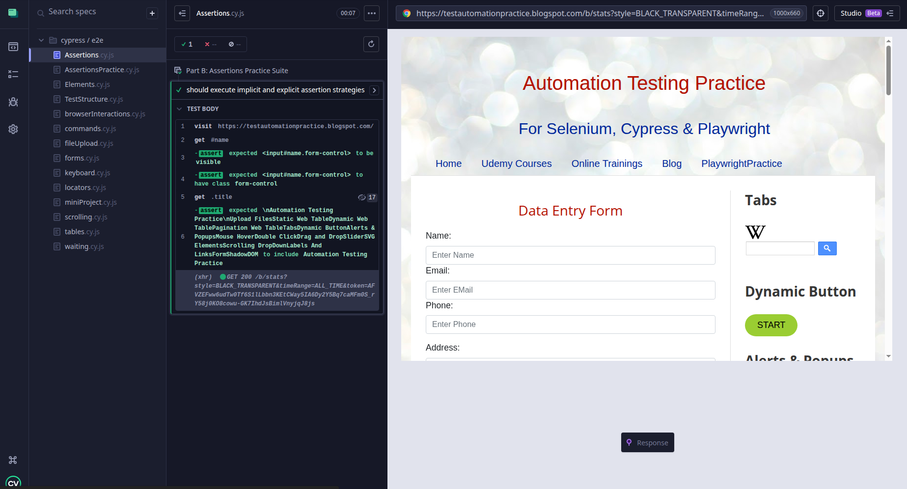

Part C

This module taught me the baseline commands required to simulate real human interactions on a webpage. I practiced navigating to URLs, typing text, clearing fields, selecting options from standard dropdowns, interacting with checkboxes, hovering, and performing context right-clicks.
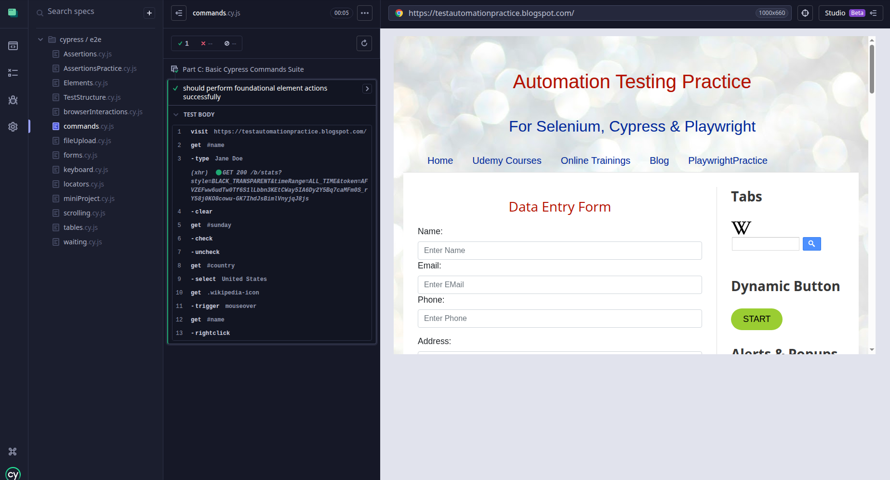
Part D

I discovered how Cypress navigates the DOM using global selectors like cy.get() and cy.contains(), alongside traversal commands like .find(), .children(), .parent(), and scoping queries using .within(). I also learned that using stable, dedicated data attributes (like data-cy) is much better than relying on long, brittle CSS selectors that break when layouts change.
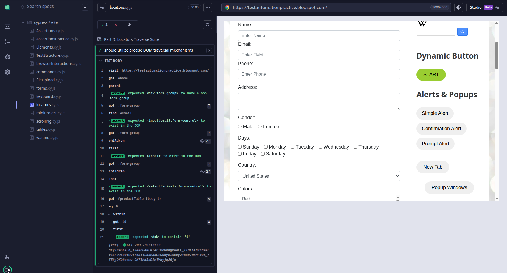

Part E

I practicalized an array of structural state checks to ensure a UI is rendered correctly and behaving as expected. 
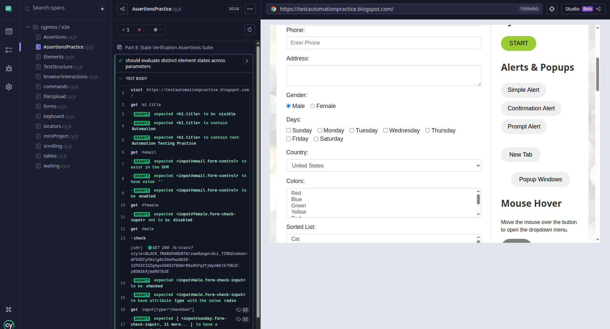

Part F

In this section, I combined my locator and action knowledge to test an assortment of native HTML elements. I built a flow that confidently interacts with buttons, inputs, checkbox states, radio selection menus, active page links, and responsive images.
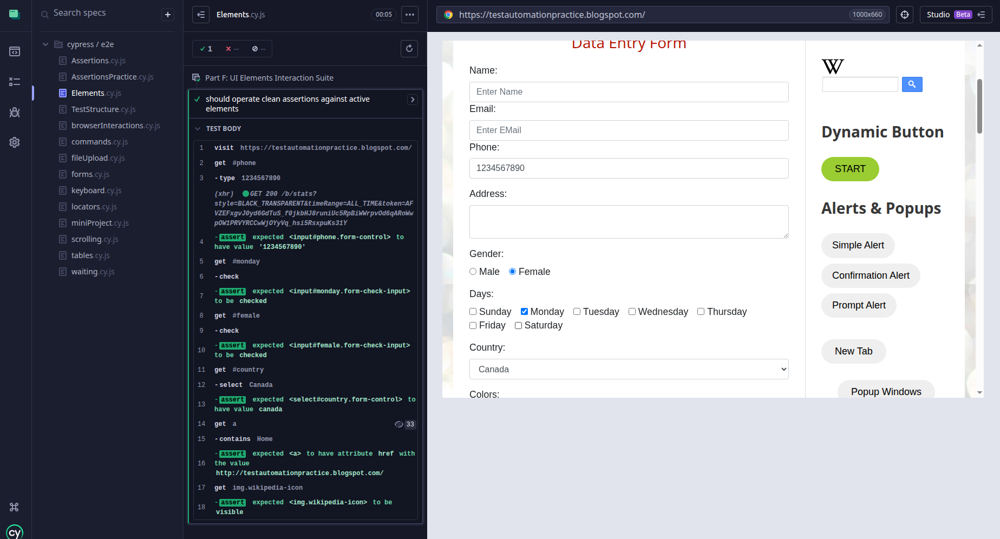

Part G

I  studied how Cypress uses automatic waiting and retry-ability to handle slow UI changes dynamically. I now understand why using arbitrary pauses like cy.wait(5000) is a bad practice that causes brittle tests, and I learned how to use element timeouts and network request routing via cy.intercept() as much faster, event-driven alternatives.

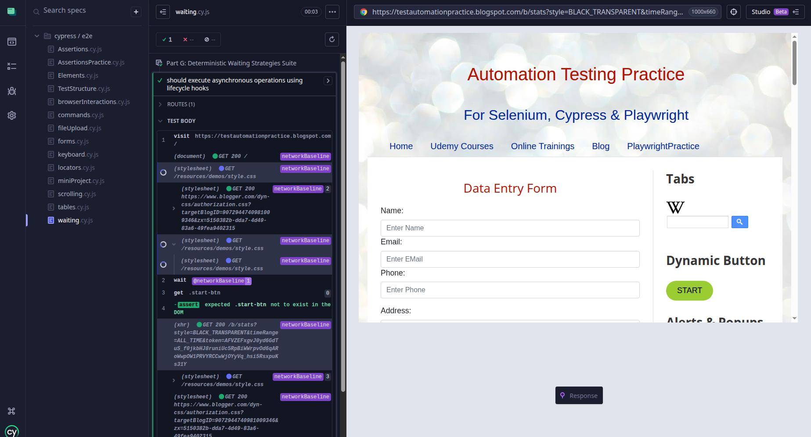

Part H 

I aggregated my input, select, and click skills into a single, comprehensive transaction that validates complex user registration or data form submissions. The test handles text fields, specific date controls, option assignments, state checks, and confirms the appearance of the server's success status banner.

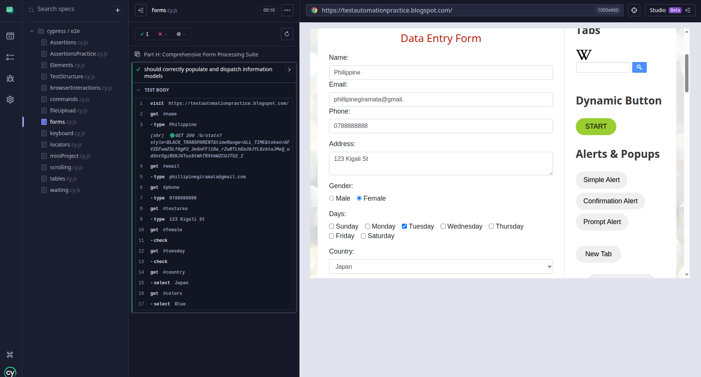

Part I 

I learned how to parse tabular layouts to measure explicit counts of rows and columns. I also learned how to isolate a specific row index using .eq() and switch my control scope into that context using .within() to read unique cell values or click inline buttons.

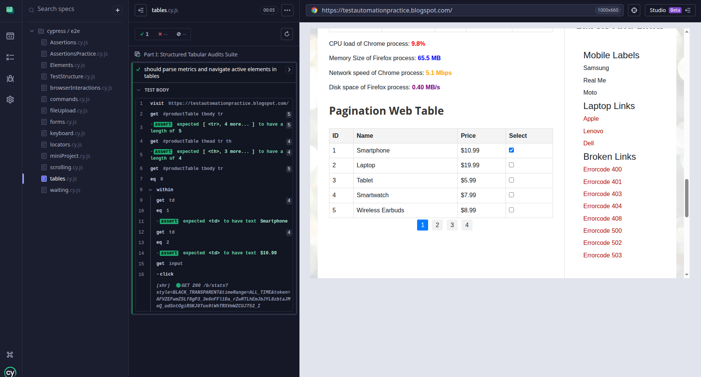

Part J

This module covered managing low-level browser actions, such as page reloads and bypassing target frames by dropping target="_blank" attributes to force links to open in the current tab. I also learned how to use window listeners to intercept and respond to native browser alert prompts, confirms, and input stubs programmatically.
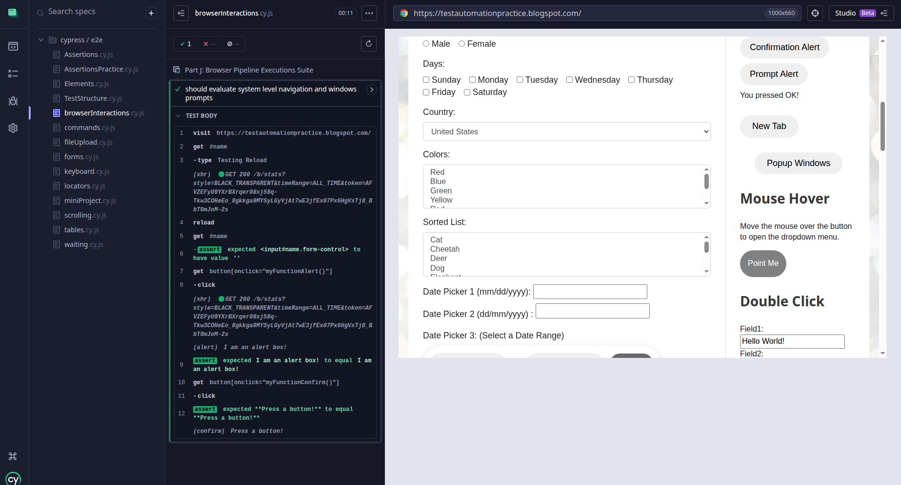

Part K

I learnt how to pass non-text special keystrokes directly into active fields to change values or remove data. I successfully simulated hardware events including arrow keys to shift numerical fields, backspaces to wipe data strings, and keypress submissions.
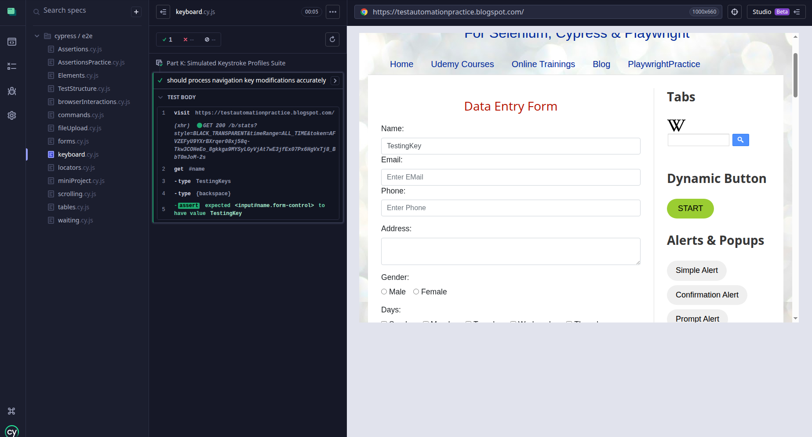

Part L

I learned how to manipulate viewport positions dynamically. I practiced scrolling across global page coordinates using boundaries like top/bottom, and bringing obscured or hidden items cleanly into focus using .scrollIntoView() before carrying out structural visibility verifications.
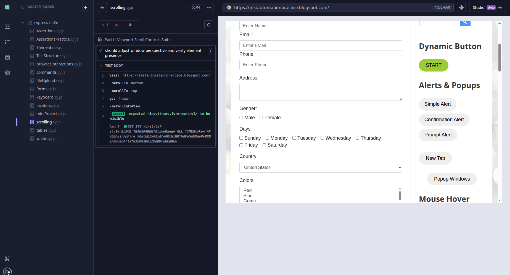

Part M

I researched why native web security traditionally restricts automated file uploads and how modern versions of Cypress solve this out-of-the-box. I learned to use the built-in .selectFile() engine to generate file buffers directly on file inputs without needing third-party plug-ins

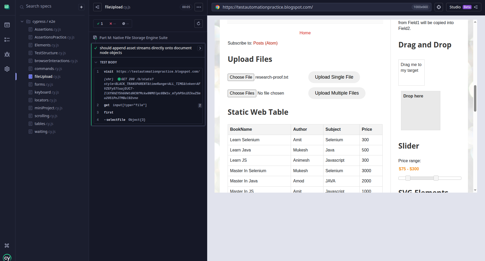

Mini project

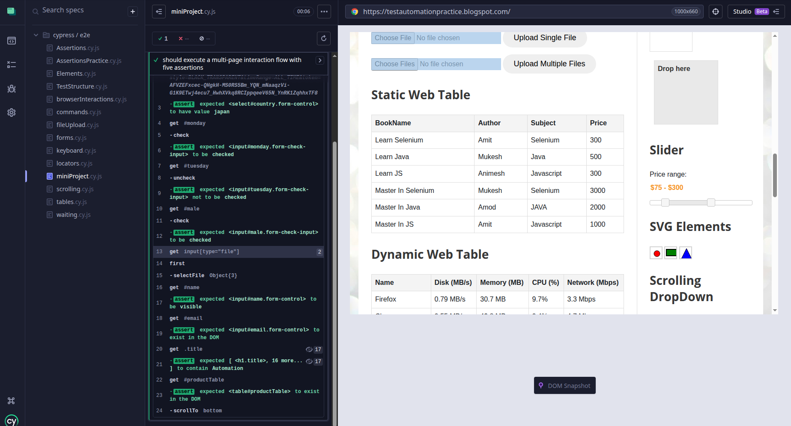

What was the easiest concept to understand?

The part that was easier to understand was the structural organization using testing hooks like describe() and it(). Mapping out test suites using natural, descriptive sentences made perfect sense and felt like writing a logical outline before actually writing the code. Additionally, basic interactive commands like .click(), .type(), and .clear() felt incredibly intuitive because they match the exact visual, physical actions I take whenever I test a website manually.
What was the most challenging?

The biggest challenge I faced was to know when to use wait strategies cy.wait, in stead of forcing the runner to completely freeze and instead let Cypress handle states dynamically using element timeouts and network request tracking. It was also a puzzle at first to narrow down locators when dealing with a page structure like the Blogger template—for example, discovering that input[type="checkbox"] was catching hidden layout checkboxes further down the table taught me exactly why precise targeting filters are necessary to prevent tests from breaking. Lastly, fixing errors gave me quite a hard time, which taught me how to fix them properly.

